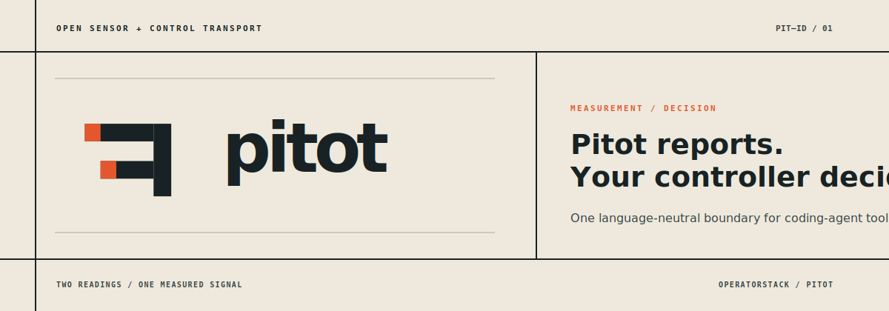
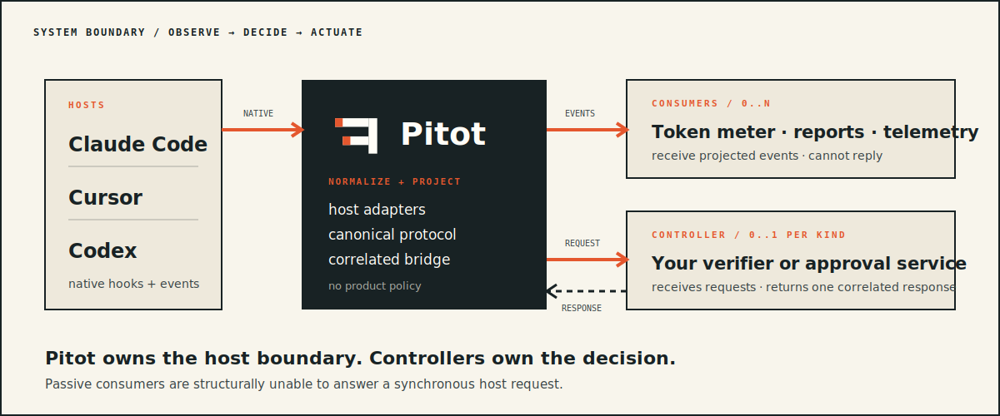
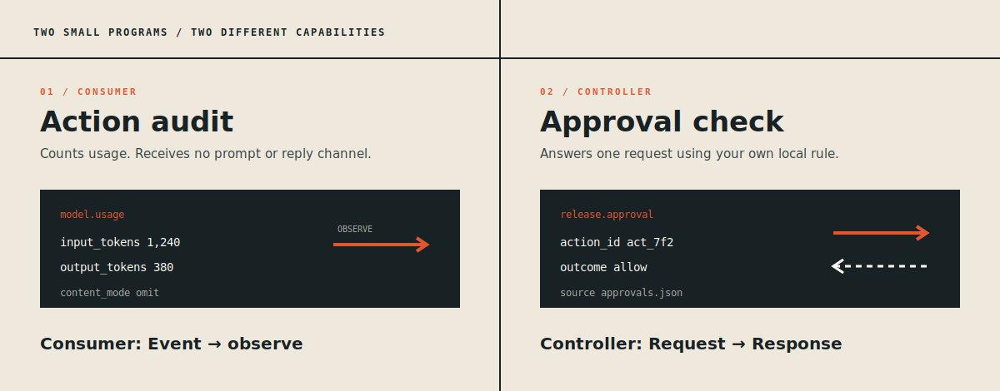

<p align="center">
  
</p>

<p align="center">
  <strong>Keep your coding agent. Add the behavior it is missing.</strong>
</p>

<!-- pitot-adapter-supervisor:start -->
<p align="center">
  <a href="https://github.com/operatorstack/intelligence-flow/actions/workflows/pitot-e2e.yml"></a>
</p>

<p align="center"><sub>Every supervised adapter must pass a binary-observed prompt → real hook → projected Consumer → Controller allow/deny → tool-result loop on Ubuntu, macOS, and Windows.</sub></p>

<p align="center"><sub>Supervised adapters: Claude · Cursor · Codex · GitHub Copilot CLI · Gemini · Kimi Code · OpenCode · Pi · Qwen Code</sub></p>

<p align="center"><sub>Supervised runtime capabilities: hook control · Consumer delivery · explicit request</sub></p>
<!-- pitot-adapter-supervisor:end -->

<p align="center">
  One language-neutral boundary for the coding agents your team already uses.
</p>

Your coding agent runs shell commands, edits files, and calls tools. Pitot lets
you put your own code in the loop at that boundary — to allow, deny, or record
each action — without forking the agent or rewriting a host integration for
every tool.

Pitot reports what happened. Your code decides what it means.

## See it work with Kimi

The fastest way to understand Pitot is to watch one real command get allowed and
another get denied. This walkthrough is exactly what Pitot's automated test suite
exercises on every commit, so the behavior below is verified, not aspirational.

**1. Scaffold a sample shell policy.** This writes a runnable Controller that
allows shell commands by default and denies any command containing the canary
string `PITOT_DENY_ME`:

```bash
pitot init --template shell-policy --language go --dir ./kimi-policy
cd ./kimi-policy
```

**2. Check your Kimi host wiring** (Pitot does not edit your Kimi config for you):

```bash
pitot doctor --host kimi
```

If the `PreToolUse` hook is missing, add it to `~/.kimi-code/config.toml`:

```toml
[[hooks]]
event = "PreToolUse"
matcher = "Bash"
command = "pitot hook kimi"
```

**3. Run Kimi behind the Controller.** `pitot dev` starts the runtime, launches
the agent you name after `--`, and prints each decision:

```bash
pitot dev --host kimi -- kimi -p "Run: echo hello"
```

An ordinary command is allowed and runs. Now ask for the canary:

```bash
pitot dev --host kimi -- kimi -p "Run: PITOT_DENY_ME=1 echo nope"
```

The Controller denies it. The denied command never executes, and the denial
reason — `Pitot sample policy blocked the PITOT_DENY_ME canary.` — is returned to
Kimi as the blocked tool result. The `shell-policy` sample is a demonstration
tripwire, not a general shell-security control; the point is that *your* code
made the decision.

## Why Pitot?

Building above coding agents usually forces one of two expensive choices:

1. Maintain separate hooks, payload decoders, response formats, version quirks,
   and diagnostics for every host.
2. Own or fork an entire coding-agent runtime just to gain a dependable event
   boundary.

Pitot provides a third option: keep the coding agents your users already chose,
integrate with their host boundary once, and build only the product that
differentiates you.

<p align="center">
  
</p>

Pitot separates two capabilities that are easy to blur:

| Role | Receives | Can reply? | Typical use |
|---|---|---:|---|
| **Consumer** | Projected events | No | Usage, memory, analytics, reports |
| **Controller** | Registered requests | Yes | Approval, verification, policy, workflow |

A passive Consumer cannot reach the response channel. A Controller is
statically registered for one request kind and returns at most one response for
the pending action.

## Two small programs

<p align="center">
  
</p>

### 1. Audit shell requests without recording commands

Configure a Consumer with an `omit` content projection:

```yaml
consumers:
  - id: action-audit
    command: ["python3", "./examples/action-audit.py"]
    events: ["action.requested"]
    projection:
      content: omit
```

Pitot writes newline-delimited JSON to the program's standard input:

```json
{"pitot_version":"1","type":"action.requested","host":{"name":"claude"},"action":{"id":"act_7f2","kind":"shell"},"content":{"mode":"omit"},"observation":{"source":"host_hook","fidelity":"direct"}}
```

The Consumer is ordinary Python—no Pitot SDK required:

```python
import json
import sys

for line in sys.stdin:
    event = json.loads(line)
    print(json.dumps({
        "host": event["host"]["name"],
        "action_id": event["action"]["id"],
        "kind": event["action"]["kind"],
    }), file=sys.stderr)
```

The command is projected out before bytes enter the Consumer pipe. Consumer
failure cannot allow or deny the waiting host action.

### 2. Let a skill request approval

A coding-agent skill can make a synchronous request:

```bash
pitot request release.approval --data '{"release":"v1.4.0"}' --runtime "$PITOT_RUNTIME"
```

Register one Controller for that request kind:

```yaml
controllers:
  release.approval:
    id: local-approval
    command: ["./examples/local-approval"]
    deadline_ms: 2000
    on_timeout: deny
    on_unavailable: deny
```

The Controller receives:

```json
{"pitot_version":"1","type":"control.requested","kind":"release.approval","action_id":"act_7f2","data":{"release":"v1.4.0"}}
```

It checks its own source of truth and returns one correlated response:

```json
{"pitot_version":"1","type":"control.response","controller_id":"local-approval","action_id":"act_7f2","outcome":"allow","message":"v1.4.0 is approved for publication."}
```

Pitot validates the controller identity, action ID, deadline, schema, and
single-response rule before carrying the answer back. Pitot does not know what
“approved” means; the Controller owns that definition.

## Install

Download a release binary for macOS, Linux, or Windows, or install from source:

```bash
go install github.com/operatorstack/pitot/cmd/pitot@latest
```

Inspect the effective local boundary at any time:

```bash
pitot doctor
```

## Quickstart

**1. Scaffold a Controller.** `pitot init` writes a runnable project — source, a
package manifest, and `.pitot.yaml` — and never overwrites existing files unless
you pass `--force`. Pick a starting template with `--template`:

```bash
pitot init --template shell-policy --language go --dir ./kimi-policy
```

```
Initialized go controller (shell-policy) in ./kimi-policy
Files written: .pitot.yaml, go.mod, main.go
Next:
  1. cd ./kimi-policy
  2. Configure a supported host hook (see: pitot doctor --host HOST).
  3. Run: pitot dev --host HOST -- AGENT [ARGS...]
     example: pitot dev --host kimi -- kimi -p "<prompt>"
```

Available templates are `shell-policy` (allow/deny shell commands),
`release-approval` and `blank-controller` (request/response controllers), and
`blank-consumer` (a passive event reader). Without `--template`, `pitot init`
detects the language from the current directory or prompts you to choose. The
four first-class languages (`python`, `typescript`, `go`, `rust`) each generate a
complete project that builds after installing dependencies.

**2. Run your agent behind it.** `pitot dev` starts the runtime and the
Controllers declared in `.pitot.yaml`, waits until the runtime is ready, then
launches the agent you name after `--` with `PITOT_RUNTIME` set so its host hook
finds the runtime. It prints each decision as the agent makes it:

```bash
pitot dev --host kimi -- kimi -p "Run: PITOT_DENY_ME=1 echo nope"
```

```
Starting Pitot dev environment for host kimi...
Runtime ready. Starting agent: kimi -p Run: PITOT_DENY_ME=1 echo nope
Decisions:
  [DENY]  shell (act_1a9) — Pitot sample policy blocked the PITOT_DENY_ME canary.
Agent finished. Runtime stopped.
```

`--host` must name a supported agent (`claude`, `codex`, `copilot`, `cursor`,
`gemini`, `kimi`, `opencode`, `pi`, `qwen`), and that agent's host hook must
already be wired to `pitot hook HOST` (see **Connect your agent** and
`pitot doctor --host HOST`). The runtime descriptor lives in a per-invocation
temporary path and is removed on exit, so concurrent `pitot dev` sessions never
collide.

**3. Swap the agent.** The same project — the same Controller and `.pitot.yaml` —
works with any other supported host whose hook is wired. Change only `--host` and
the agent command:

```bash
pitot dev --host cursor -- cursor-agent -p "Run: PITOT_DENY_ME=1 echo nope"
```

The boundary is language- and agent-neutral: one Controller, every agent.

## Advanced: manual runtime

`pitot dev` is the recommended path. If you need to manage the runtime yourself
(for example, sharing one runtime across several long-lived agent sessions),
start it with repository-owned configuration and an owner-only runtime
descriptor:

```bash
export PITOT_RUNTIME="${XDG_RUNTIME_DIR:-$TMPDIR}/pitot/project.json"
pitot run --config .pitot.yaml --runtime "$PITOT_RUNTIME"
```

Start coding-agent CLIs from the same environment. Their `pitot hook HOST`
commands discover the authenticated runtime through `PITOT_RUNTIME`. Without
that variable or `--runtime PATH`, hooks remain observation-only for backwards
compatibility. Once a runtime is explicitly selected, transport or
authentication failure blocks the controllable action.

On Windows, set the descriptor in the launching PowerShell session:

```powershell
$env:PITOT_RUNTIME = Join-Path $env:LOCALAPPDATA "Pitot\project.json"
pitot run --config .pitot.yaml --runtime $env:PITOT_RUNTIME
```

## Supported hosts

Every host below normalizes its native blocking boundary to a `shell` action and
passes Pitot's language-neutral decoder conformance suite. The E2E column marks
adapters exercised by the cross-platform agent supervisor (the badge at the top)
on Ubuntu, macOS, and Windows. Kimi additionally has an in-repo, no-model test
that asserts the full allow **and** deny control path end to end.

| Host | Blocking boundary | Hook wiring | Verified in this repo |
|---|---|---|---|
| Kimi Code | `PreToolUse` / Bash | native `config.toml` | decoder + E2E + allow/deny control test |
| Claude | `PreToolUse` | native settings hook | decoder + E2E |
| Cursor | `beforeShellExecution` | bridge (`integrations/cursor`) | decoder + E2E |
| Codex | `PreToolUse` | bridge (`integrations/codex`) | decoder + E2E |
| GitHub Copilot CLI | `PreToolUse` | bridge (`integrations/copilot`) | decoder + E2E |
| Gemini | `BeforeTool` | bridge (`integrations/gemini`) | decoder + E2E |
| OpenCode | `PreToolUse` | bridge (`integrations/opencode`) | decoder + E2E |
| Pi | `tool_call` | extension (`integrations/pi`) | decoder + E2E |
| Qwen Code | `PreToolUse` | bridge (`integrations/qwen`) | decoder + E2E |

"Decoder" means Pitot correctly normalizes that host's payload into the stable
event envelope. It does not claim Pitot judges whether any command is safe — that
decision belongs to your Controller.

## Connect your agent

The per-host hooks below wire each agent's native blocking boundary to Pitot.
This wiring is a one-time edit to each host's own configuration; Pitot does not
edit your host config for you. Run `pitot doctor --host HOST` to check whether a
host's hook is correctly configured. Once wired, both `pitot dev` and the manual
runtime flow use the same hook.

### Kimi Code

Install Kimi Code on macOS or Linux using its official installer:

```bash
curl -fsSL https://code.kimi.com/kimi-code/install.sh | bash
kimi --version
```

On Windows, use the official PowerShell installer:

```powershell
irm https://code.kimi.com/kimi-code/install.ps1 | iex
kimi --version
```

Connect Kimi Code's blocking shell boundary to Pitot in
`~/.kimi-code/config.toml`:

```toml
[[hooks]]
event = "PreToolUse"
matcher = "Bash"
command = "pitot hook kimi"
```

Kimi sends the hook payload to Pitot on standard input. Pitot exits `0` when
the request is accepted and `2` when input is malformed or the configured
Controller denies the action. Check
the non-interactive Kimi CLI after configuration with:

```bash
kimi -p "Show the repository status"
```

See the [Kimi Code documentation](https://www.kimi.com/code/docs/en/) for CLI
authentication, configuration, and hook behavior.

### GitHub Copilot CLI

Copy `integrations/copilot/PreToolUse` to a stable executable path (or use
`PreToolUse.ps1` on Windows), then add the following Claude-compatible hook to
`~/.copilot/settings.json`:

```json
{
  "hooks": {
    "PreToolUse": [{
      "matcher": "Bash",
      "hooks": [{"type": "command", "command": "/path/to/PreToolUse"}]
    }]
  }
}
```

The bridge keeps the blocking payload on Pitot's standard `hook_event_name`
and `tool_input.command` boundary and returns Copilot's structured native deny
reason when a Controller rejects the command. See the official
[Copilot CLI hooks reference](https://docs.github.com/en/copilot/reference/hooks-reference).

### Cursor

Copy `integrations/cursor/beforeShellExecution` into the repository and point
`.cursor/hooks.json` at it with `failClosed: true`. The bridge returns Cursor's
native `permission: "deny"` envelope, including the Controller message, while
the runtime remains available through `PITOT_RUNTIME`. See Cursor's
[hooks documentation](https://cursor.com/docs/agent/hooks).

### Gemini

Copy `integrations/gemini/BeforeTool` to an executable path (or use
`BeforeTool.ps1` on Windows) and register it as a `BeforeTool` command hook for
`run_shell_command`. The bridge translates Pitot rejection into Gemini's
structured `decision: "deny"` and `reason` response so the model receives the
blocked tool result. See the [Gemini CLI hooks reference](https://geminicli.com/docs/hooks/reference/).

### Qwen Code

Copy `integrations/qwen/PreToolUse` to a stable executable path (or use the
Node-based `PreToolUse.cjs` bridge on Windows), then add this command hook to
`~/.qwen/settings.json`:

```json
{
  "hooks": {
    "PreToolUse": [{
      "matcher": "^Bash$",
      "hooks": [{"type": "command", "command": "/path/to/PreToolUse"}]
    }]
  }
}
```

Qwen sends the native JSON payload on standard input. The bridge returns its
native structured allow or deny decision and preserves the Controller reason.
See the official
[Qwen Code hooks guide](https://qwenlm.github.io/qwen-code-docs/en/users/features/hooks/).

### Pi

Copy `integrations/pi/pitot.ts` into `~/.pi/agent/extensions/pitot.ts` (or the
repository-local `.pi/extensions/` directory). The extension converts Pi's
blocking `tool_call` event into Pitot's stable envelope and returns Pi's native
`block` response when Pitot rejects the request. See the official
[Pi extensions documentation](https://pi.dev/docs/latest/extensions).

Pitot uses supervised local processes in v1. It starts declared Consumers and
Controllers itself, applies each projection before bytes enter the child pipe,
and exposes only a loopback endpoint authenticated by the owner-only runtime
descriptor. The capability token is never passed to child processes or logs.

## Language-neutral by design

Pitot's reference implementation is Go. Its public contract is not.

Compatibility is defined by:

- versioned JSON Schemas;
- newline-delimited JSON framing;
- explicit request/response state machines;
- capability and projection declarations; and
- language-neutral conformance fixtures.

If a program can read JSON Lines from standard input, it can be a Consumer. If
it can return one schema-valid response on its dedicated output channel, it can
be a Controller.

Official client libraries are optional conveniences—not a prerequisite and
not the source of protocol truth.

## Event envelope

Every event identifies its schema, source, session, and observation quality:

```json
{
  "pitot_version": "1",
  "id": "evt_01J...",
  "type": "action.requested",
  "time": "2026-07-19T16:05:00Z",
  "host": {
    "name": "cursor",
    "adapter_version": "1.0.0"
  },
  "session_id": "sess_42",
  "action": {
    "id": "act_7f2",
    "kind": "shell"
  },
  "content": {
    "mode": "sha256",
    "sha256": "9f2..."
  },
  "observation": {
    "source": "host_hook",
    "fidelity": "direct"
  }
}
```

Adapters preserve host capability differences. A normalized field is never
presented as directly observed when the host omitted it or Pitot inferred it.

## Controller guarantees

Synchronous hooks are control channels: the host is blocked waiting for an
answer. Pitot makes that privilege explicit.

- Exactly one Controller may register for a request kind.
- Registration is static, auditable configuration.
- The registration declares a deadline and unavailable/timeout defaults.
- Every response is bound to its pending action and Controller identity.
- Late, stale, duplicate, mismatched, and malformed responses are rejected.
- A pending action receives exactly one terminal resolution.
- Registration and its configuration fingerprint appear in diagnostics.

The bridge mechanically enforces the declared default. It contains no approval,
safety, completion, or shipping policy engine.

## Boundary faults

Pitot distinguishes a broken measurement boundary from a judgment about the
work:

```json
{
  "pitot_version": "1",
  "type": "boundary.fault",
  "host": "cursor",
  "action_id": "act_7f2",
  "reason": "empty-command"
}
```

Reason codes never contain prompts, commands, tool inputs, or outputs. A
Controller may choose to deny, retry, report, or escalate the fault according
to its own policy.

## Privacy model

Pitot is local and storage-free by default.

- Raw host payloads terminate inside the adapter.
- Content projection is `full`, `sha256`, or `omit` per Consumer.
- Projection happens before delivery, not inside downstream applications.
- No network exporter is enabled implicitly.
- Pitot does not retain an event history unless a configured Consumer does.
- Passive Consumers receive no Controller capability.
- Diagnostics and fault codes are content-safe.

## What can you build?

- selective cross-agent memory;
- session and decision reports;
- token and cost attribution;
- reliability and host-compatibility diagnostics;
- OpenTelemetry exporters;
- human approval routers;
- security or compliance Controllers;
- delivery verifiers;
- custom agent interfaces over existing runtimes; and
- new Pitot-compatible coding-agent runtimes.

## What Pitot does not decide

Pitot does not define whether:

- work is correct or complete;
- an action is safe;
- a person granted approval;
- evidence satisfies a requirement;
- a claim is valid; or
- something may be shipped.

Those meanings belong to your Controller. **Pitot reports. Your controller
decides.**

## Project layout

```text
pitot/
├── schema/          public event and response schemas
├── protocol/        framing and state-machine specifications
├── adapters/        built-in coding-agent hook boundaries
├── sensor/          normalization and observation pipeline
├── bridge/          controller routing and response transport
├── projection/      full, sha256, and omit policies
├── config/          strict Consumer and Controller declarations
├── runtime/         authenticated ingress and local process delivery
├── conformance/     language-neutral fixtures and negative controls
├── examples/        local approval and Consumer examples
└── cmd/pitot/        reference Go executable
```

## Design principles

1. **Report before interpretation.** Preserve what the host actually supplied.
2. **Make capability structural.** Consumers cannot reply; Controllers can.
3. **Keep host churn together.** Decoders and encoders share one compatibility
   boundary.
4. **Project before delivery.** Privacy is enforced before content crosses the
   process boundary.
5. **Correlate every answer.** A response can resolve only its pending action.
6. **Prefer one maintained implementation.** Use a language-neutral protocol
   instead of rewriting the host boundary in every ecosystem.
7. **Extend standards where they fit.** Map to OpenTelemetry GenAI conventions
   without erasing Pitot-specific provenance or semantic events.

## Name

A pitot probe measures pressure difference so another system can determine
airspeed. It does not fly the aircraft.

Pitot applies the same separation to coding-agent tooling: measurement belongs
at the host boundary; interpretation and control belong downstream.

## Contributing

Start with the protocol and conformance fixtures. A new adapter should declare
its host capabilities, normalize supported events, classify boundary faults
without exposing content, encode Controller responses, and pass the shared
positive and negative fixture suite.

See [CONTRIBUTING.md](CONTRIBUTING.md) for development setup and compatibility
requirements.

## License

Apache-2.0
