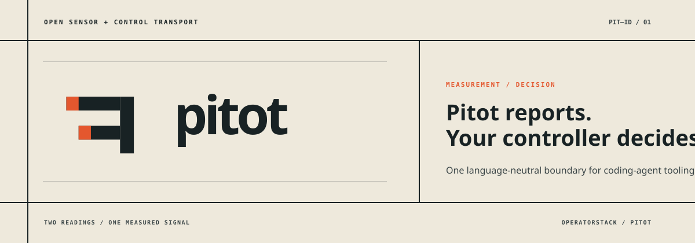
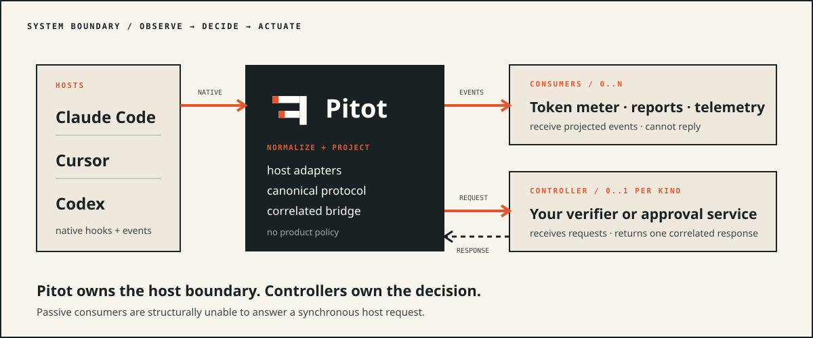
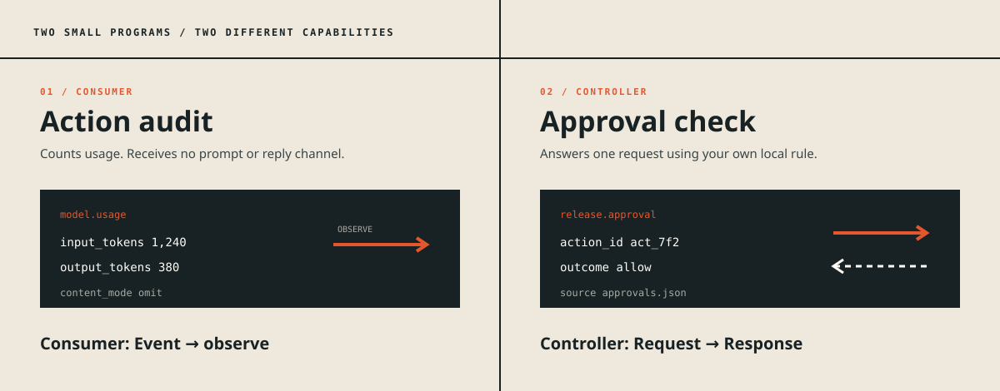

<p align="center">
  
</p>

<p align="center">
  <strong>Keep your coding agent. Add the behavior it is missing.</strong>
</p>

<!-- pitot-adapter-supervisor:start -->
<p align="center">
  <a href="https://github.com/operatorstack/intelligence-flow/actions/workflows/pitot-e2e.yml"></a>
</p>

<p align="center"><sub>Every supervised adapter must pass a binary-observed prompt → real action boundary → projected Consumer → Controller allow/deny → tool-result loop on Ubuntu, macOS, and Windows.</sub></p>

<p align="center"><sub>Supervised adapters: Claude · Cursor · Codex · Devin · GitHub Copilot CLI · Gemini · Kimi Code · OpenCode · Pi · Qwen Code</sub></p>

<p align="center"><sub>Supervised runtime capabilities: action control · Consumer delivery · explicit request</sub></p>
<!-- pitot-adapter-supervisor:end -->

<p align="center">
  One language-neutral boundary for the coding agents your team already uses.
</p>

Your coding agent runs shell commands, edits files, and calls tools. Pitot lets
you put your own code in the loop at that boundary — to allow, deny, or record
each action — without forking the agent or rewriting a host integration for
every tool.

Pitot reports what happened. Your code decides what it means.

## See it work with Kimi

The fastest way to understand Pitot is to watch one real command get allowed and
another get denied. This walkthrough is exactly what Pitot's automated test suite
exercises on every commit, so the behavior below is verified, not aspirational.

**1. Scaffold a sample shell policy.** This writes a runnable Controller that
allows shell commands by default and denies any command containing the canary
string `PITOT_DENY_ME`:

```bash
pitot init --template shell-policy --language go --dir ./kimi-policy
cd ./kimi-policy
```

**2. Check your Kimi host wiring** (Pitot does not edit your Kimi config for you):

```bash
pitot doctor --host kimi
```

If the `PreToolUse` hook is missing, add it to `~/.kimi-code/config.toml`:

```toml
[[hooks]]
event = "PreToolUse"
matcher = "Bash"
command = "pitot hook kimi"
```

**3. Run Kimi behind the Controller.** `pitot dev` starts the runtime, launches
the agent you name after `--`, and prints each decision:

```bash
pitot dev --host kimi -- kimi -p "Run: echo hello"
```

An ordinary command is allowed and runs. Now ask for the canary:

```bash
pitot dev --host kimi -- kimi -p "Run: PITOT_DENY_ME=1 echo nope"
```

The Controller denies it. The denied command never executes, and the denial
reason — `Pitot sample policy blocked the PITOT_DENY_ME canary.` — is returned to
Kimi as the blocked tool result. The `shell-policy` sample is a demonstration
tripwire, not a general shell-security control; the point is that *your* code
made the decision.

### Devin uses ACP

Devin exposes the same Pitot control semantics through a stateful ACP boundary,
so it does not need lifecycle-hook files:

```bash
pitot doctor --host devin
pitot dev --host devin -- devin -p "Run: echo hello"
```

To attach to an already-running Pitot runtime, use the explicit single-prompt
surface:

```bash
pitot acp devin --runtime "$PITOT_RUNTIME" --prompt "Run: echo hello"
```

Pitot selects only ACP's one-shot `allow_once` or `reject_once` options.
Interactive, resume, and multi-turn Devin sessions are not supported in this
initial adapter.

## Why Pitot?

Building above coding agents usually forces one of two expensive choices:

1. Maintain separate hooks, payload decoders, response formats, version quirks,
   and diagnostics for every host.
2. Own or fork an entire coding-agent runtime just to gain a dependable event
   boundary.

Pitot provides a third option: keep the coding agents your users already chose,
integrate with their host boundary once, and build only the product that
differentiates you.

<p align="center">
  
</p>

Pitot separates two capabilities that are easy to blur:

| Role | Receives | Can reply? | Typical use |
|---|---|---:|---|
| **Consumer** | Projected events | No | Usage, memory, analytics, reports |
| **Controller** | Registered requests | Yes | Approval, verification, policy, workflow |

A passive Consumer cannot reach the response channel. A Controller is
statically registered for one request kind and returns at most one response for
the pending action.

## Two small programs

<p align="center">
  
</p>

### 1. Audit shell requests without recording commands

Configure a Consumer with an `omit` content projection:

```yaml
consumers:
  - id: action-audit
    command: ["python3", "./examples/action-audit.py"]
    events: ["action.requested"]
    projection:
      content: omit
```

Pitot writes newline-delimited JSON to the program's standard input:

```json
{"pitot_version":"1","type":"action.requested","host":{"name":"claude"},"action":{"id":"act_7f2","kind":"shell"},"content":{"mode":"omit"},"observation":{"source":"host_hook","fidelity":"direct"}}
```

The Consumer is ordinary Python—no Pitot SDK required:

```python
import json
import sys

for line in sys.stdin:
    event = json.loads(line)
    print(json.dumps({
        "host": event["host"]["name"],
        "action_id": event["action"]["id"],
        "kind": event["action"]["kind"],
    }), file=sys.stderr)
```

The command is projected out before bytes enter the Consumer pipe. Consumer
failure cannot allow or deny the waiting host action.

### 2. Let a skill request approval

A coding-agent skill can make a synchronous request:

```bash
pitot request release.approval --data '{"release":"v1.4.0"}' --runtime "$PITOT_RUNTIME"
```

Register one Controller for that request kind:

```yaml
controllers:
  release.approval:
    id: local-approval
    command: ["./examples/local-approval"]
    deadline_ms: 2000
    on_timeout: deny
    on_unavailable: deny
```

The Controller receives:

```json
{"pitot_version":"1","type":"control.requested","kind":"release.approval","action_id":"act_7f2","data":{"release":"v1.4.0"}}
```

It checks its own source of truth and returns one correlated response:

```json
{"pitot_version":"1","type":"control.response","controller_id":"local-approval","action_id":"act_7f2","outcome":"allow","message":"v1.4.0 is approved for publication."}
```

Pitot validates the controller identity, action ID, deadline, schema, and
single-response rule before carrying the answer back. Pitot does not know what
“approved” means; the Controller owns that definition.

## Install

**Nobody installs Pitot per machine — the repository pins it.** `pitot init`
writes two substrate files alongside your tenant fragments:

- `.pitot/version` — one committed semver line, the only version authority
- `.pitot/bin/pitot` (+ `pitot.ps1`) — a committed shim that reads the pin,
  hydrates exactly that release into a per-user cache
  (`~/.cache/pitot/<version>/`, sha256-verified against the published
  `checksums.txt`), and execs it

Fresh clones, CI, and cloud agents run `.pitot/bin/pitot` with zero setup —
the first invocation hydrates, every later one is a cache hit. There is no
fallback to whatever binary happens to be on PATH; a missing release with no
network fails closed with a named error, and `PITOT_NO_HYDRATE=1` makes
hydration cache-only.

**Upgrades are a reviewed diff.** `pitot upgrade` verifies the new release,
re-checks every tenant fragment against it, and rewrites the one pin line —
nothing else. Commit that diff and every clone hydrates the new version on
its next invocation; roll back by reverting it.

```bash
pitot upgrade --check   # report pinned vs latest
pitot upgrade           # hydrate, validate tenants, rewrite .pitot/version
```

For a global CLI convenience (running `pitot init` in new repos), grab a
release binary or build from source:

```bash
go install github.com/operatorstack/pitot/cmd/pitot@latest
```

Typed SDKs install from our own registry through the distribution front door
— never public npm/PyPI, pinned to the CLI's version:

```bash
pitot install typescript   # scoped .npmrc + @operatorstack/pitot@<version>
pitot install python       # .pitot/registry + operatorstack-pitot==<version>
```

(`install typescript` creates a minimal private `package.json` when the
directory has none — npm honors a project registry config only inside a
project.)

Inspect the effective local boundary, pin, and cache state at any time:

```bash
pitot doctor
```

## Quickstart

**1. Scaffold a Controller.** `pitot init` writes a runnable project — source
and a package manifest — and registers it as one tenant fragment under
`.pitot/conf.d/`. It never overwrites existing files unless you pass `--force`.
Pick a starting template with `--template`:

```bash
pitot init --template shell-policy --language go --dir kimi-policy
```

```
Initialized go controller (shell-policy) in kimi-policy
Files written: .pitot/conf.d/kimi-policy.yaml, kimi-policy/go.mod, kimi-policy/main.go
Next:
  1. Configure a supported host hook (see: pitot doctor --host HOST).
  2. Run: pitot dev --host HOST -- AGENT [ARGS...]
     example: pitot dev --host kimi -- kimi -p "<prompt>"
```

Available templates are `shell-policy` (allow/deny shell commands),
`release-approval` and `blank-controller` (request/response controllers), and
`blank-consumer` (a passive event reader). Without `--template`, `pitot init`
detects the language from the current directory or prompts you to choose. The
four first-class languages (`python`, `typescript`, `go`, `rust`) each generate a
complete project that builds after installing dependencies.

**2. Run your agent behind it.** `pitot dev` discovers every fragment under
`.pitot/conf.d/`, starts the runtime and the declared Controllers, waits until
the runtime is ready, then launches the agent you name after `--` with
`PITOT_RUNTIME` set so its host hook finds the runtime. It prints each decision
as the agent makes it:

```bash
pitot dev --host kimi -- kimi -p "Run: PITOT_DENY_ME=1 echo nope"
```

```
Starting Pitot dev environment for host kimi...
Runtime ready. Starting agent: kimi -p Run: PITOT_DENY_ME=1 echo nope
Decisions:
  [DENY]  shell (act_1a9) — Pitot sample policy blocked the PITOT_DENY_ME canary.
Agent finished. Runtime stopped.
```

`--host` must name a supported agent (`claude`, `codex`, `copilot`, `cursor`,
`devin`, `gemini`, `kimi`, `opencode`, `pi`, `qwen`). Hook-based hosts must
already be wired to `pitot hook HOST` (see **Connect your agent** and
`pitot doctor --host HOST`); Devin connects over ACP and needs no hook file.
The runtime descriptor lives in a per-invocation
temporary path and is removed on exit, so concurrent `pitot dev` sessions never
collide.

**3. Swap the agent.** The same project — the same Controller and the same
fragment — works with any other supported host whose hook is wired. Change only
`--host` and the agent command:

```bash
pitot dev --host cursor -- cursor-agent -p "Run: PITOT_DENY_ME=1 echo nope"
```

The boundary is language- and agent-neutral: one Controller, every agent.

## Multiple tools, one Pitot

Configuration is tenant-partitioned: every tool or person that registers
processes with Pitot owns exactly one fragment in `.pitot/conf.d/`, and no
tenant ever edits another tenant's file. The effective configuration is the
deterministic merge of all fragments in filename order:

```
.pitot/
  conf.d/
    boatstack.yaml    # a tool's controller, written by its installer
    interlock.yaml    # another tool's controller, different request kind
    my-policy.yaml    # your own, scaffolded by `pitot init`
```

Each fragment is a complete, strictly parsed mini-config declaring
`controllers:` and/or `consumers:`. Merge rules:

- **Consumers always compose.** Any number of tenants can observe
  `action.requested` events.
- **A request kind has one owner.** Two fragments claiming the same kind (for
  example `shell`) fail discovery with an error naming both files — a loud,
  attributable conflict instead of two tools silently fighting over one
  blocking hook. Controller and consumer ids must also be unique across
  fragments.
- **`requires_protocol: "1"`** optionally pins the protocol version a fragment
  was written against; a fragment this binary cannot honor fails discovery.
- **`dir:`** sets a process's working directory (relative to the repository
  root), so each tenant's command stays project-relative:

```yaml
controllers:
  shell:
    id: local-shell-policy
    command: ["go", "run", "main.go"]
    dir: "kimi-policy"
    deadline_ms: 2000
    on_timeout: deny
    on_unavailable: deny
```

Installing a second Pitot-based tool is therefore additive by construction: it
drops its own fragment next to yours, `pitot run`/`pitot dev` merge them, and
uninstalling it is deleting its fragment.

## Advanced: manual runtime

`pitot dev` is the recommended path. If you need to manage the runtime yourself
(for example, sharing one runtime across several long-lived agent sessions),
start it with repository-owned configuration and an owner-only runtime
descriptor:

```bash
export PITOT_RUNTIME="${XDG_RUNTIME_DIR:-$TMPDIR}/pitot/project.json"
pitot run --runtime "$PITOT_RUNTIME"
```

With no `--config`, `pitot run` discovers and merges the repository's
`.pitot/conf.d/` fragments. Pass `--config PATH` to override discovery with one
explicit file (useful for tests and ad-hoc runtimes).

Start coding-agent CLIs from the same environment. Their `pitot hook HOST`
commands discover the authenticated runtime through `PITOT_RUNTIME`. Without
that variable or `--runtime PATH`, hooks remain observation-only for backwards
compatibility. Once a runtime is explicitly selected, transport or
authentication failure blocks the controllable action.

On Windows, set the descriptor in the launching PowerShell session:

```powershell
$env:PITOT_RUNTIME = Join-Path $env:LOCALAPPDATA "Pitot\project.json"
pitot run --runtime $env:PITOT_RUNTIME
```

## Supported hosts

Every host below normalizes its native blocking boundary to a `shell` action and
passes Pitot's language-neutral decoder conformance suite. The E2E column marks
adapters exercised by the cross-platform agent supervisor (the badge at the top);
the Platforms column names the operating systems each one is verified on. Kimi
additionally has an in-repo, no-model test that asserts the full allow **and**
deny control path end to end.

| Host | Blocking boundary | Hook wiring | Platforms | Verified in this repo |
|---|---|---|---|---|
| Kimi Code | `PreToolUse` / Bash | native `config.toml` | Ubuntu · macOS · Windows | decoder + E2E + allow/deny control test |
| Claude | `PreToolUse` | native settings hook | Ubuntu · macOS · Windows | decoder + E2E |
| Cursor | `beforeShellExecution` | bridge (`integrations/cursor`) | Ubuntu · macOS · Windows (WSL) | decoder + E2E |
| Codex | `PreToolUse` | bridge (`integrations/codex`) | Ubuntu · macOS · Windows | decoder + E2E |
| Devin | `session/request_permission` (ACP) | stateful ACP transport | Ubuntu · macOS · Windows | decoder + E2E |
| GitHub Copilot CLI | `PreToolUse` | bridge (`integrations/copilot`) | Ubuntu · macOS · Windows | decoder + E2E |
| Gemini | `BeforeTool` | bridge (`integrations/gemini`) | Ubuntu · macOS · Windows | decoder + E2E |
| OpenCode | `PreToolUse` | bridge (`integrations/opencode`) | Ubuntu · macOS · Windows | decoder + E2E |
| Pi | `tool_call` | extension (`integrations/pi`) | Ubuntu · macOS · Windows | decoder + E2E |
| Qwen Code | `PreToolUse` | bridge (`integrations/qwen`) | Ubuntu · macOS · Windows | decoder + E2E |

"Decoder" means Pitot correctly normalizes that host's payload into the stable
event envelope. It does not claim Pitot judges whether any command is safe — that
decision belongs to your Controller. On Windows, Cursor runs under WSL; every
other host runs natively.

## Host admission criteria

A host earns a supervised adapter only when its blocking boundary can complete
Pitot's causal loop: a proposed command must reach a Controller, an allow or
deny decision must apply **before** the command runs, and — critically — a
denied action must return to the model so the agent can continue from the
blocked outcome rather than halting. This last requirement, deny-continuation,
is what distinguishes a supervisable boundary from one that can only abort.

Devin is the worked example. Its lifecycle hooks (`PreToolUse`,
`PermissionRequest`) apply a denial but end the turn instead of handing the
rejected outcome back to the model, so they do not complete the loop in
non-interactive mode. Its Agent Client Protocol surface does: the client
selects `reject_once`, the canary never executes, and Devin makes a follow-up
model request carrying the rejection and continues. Pitot therefore ships Devin
over ACP and does not ship the hook wiring. The full investigation, including
the content-safe evidence receipt, is in
[docs/devin-adapter-research.md](docs/devin-adapter-research.md).

## Connect your agent

The per-host hooks below wire each agent's native blocking boundary to Pitot.
Hosts whose hook config lives **in the repository** are wired by Pitot itself:

```bash
pitot init --host claude    # also: cursor, codex, gemini
```

That writes exactly one marker-owned entry into the host's repo config
(`.claude/settings.json`, `.cursor/hooks.json`, `.codex/hooks.json`,
`.gemini/settings.json`), pointing at the repo shim — foreign entries are
never touched, and the committed fragment `.pitot/hooks/<host>.fragment.json`
witnesses what was installed. `pitot doctor --host HOST` reports the entry as
FOUND, MISSING, or DRIFTED against that witness; `pitot doctor --host HOST
--fix` restores a drifted entry (Pitot's own entries only — that is the single
mutation doctor ever performs, and only on request).

Hosts configured at **user level** (Kimi, Copilot, Qwen) or via **plugin
files** (OpenCode, Pi) keep the one-time manual edit below — Pitot does not
edit files outside the repository; `pitot init --host kimi` prints the exact
snippet. Once wired, both `pitot dev` and the manual runtime flow use the same
hook.

### Claude Code / Codex

```bash
pitot init --host claude
pitot init --host codex
```

Both wire a `PreToolUse` hook (matcher `Bash`) whose command runs the repo
shim: `"$CLAUDE_PROJECT_DIR"/.pitot/bin/pitot hook claude` (Codex uses the
repo-relative equivalent plus a PowerShell `commandWindows`). Exit `0` allows;
exit `2` blocks with the Controller's reason.

### Kimi Code

Install Kimi Code on macOS or Linux using its official installer:

```bash
curl -fsSL https://code.kimi.com/kimi-code/install.sh | bash
kimi --version
```

On Windows, use the official PowerShell installer:

```powershell
irm https://code.kimi.com/kimi-code/install.ps1 | iex
kimi --version
```

Connect Kimi Code's blocking shell boundary to Pitot in
`~/.kimi-code/config.toml`:

```toml
[[hooks]]
event = "PreToolUse"
matcher = "Bash"
command = "pitot hook kimi"
```

Kimi sends the hook payload to Pitot on standard input. Pitot exits `0` when
the request is accepted and `2` when input is malformed or the configured
Controller denies the action. Check
the non-interactive Kimi CLI after configuration with:

```bash
kimi -p "Show the repository status"
```

See the [Kimi Code documentation](https://www.kimi.com/code/docs/en/) for CLI
authentication, configuration, and hook behavior.

### GitHub Copilot CLI

Copy `integrations/copilot/PreToolUse` to a stable executable path (or use
`PreToolUse.ps1` on Windows), then add the following Claude-compatible hook to
`~/.copilot/settings.json`:

```json
{
  "hooks": {
    "PreToolUse": [{
      "matcher": "Bash",
      "hooks": [{"type": "command", "command": "/path/to/PreToolUse"}]
    }]
  }
}
```

The bridge keeps the blocking payload on Pitot's standard `hook_event_name`
and `tool_input.command` boundary and returns Copilot's structured native deny
reason when a Controller rejects the command. See the official
[Copilot CLI hooks reference](https://docs.github.com/en/copilot/reference/hooks-reference).

### Cursor

```bash
pitot init --host cursor
```

Writes the committed bridge `.pitot/bin/hooks/cursor-beforeShellExecution`
(which execs the repo shim and returns Cursor's native `permission: "deny"`
envelope, including the Controller message) and points `.cursor/hooks.json` at
it with `failClosed: true`. See Cursor's
[hooks documentation](https://cursor.com/docs/agent/hooks).

### Gemini

```bash
pitot init --host gemini
```

Writes the committed bridge `.pitot/bin/hooks/gemini-BeforeTool` and registers
it as a `BeforeTool` command hook for `run_shell_command`. The bridge
translates Pitot rejection into Gemini's structured `decision: "deny"` and
`reason` response so the model receives the blocked tool result. See the
[Gemini CLI hooks reference](https://geminicli.com/docs/hooks/reference/).

### Qwen Code

Copy `integrations/qwen/PreToolUse` to a stable executable path (or use the
Node-based `PreToolUse.cjs` bridge on Windows), then add this command hook to
`~/.qwen/settings.json`:

```json
{
  "hooks": {
    "PreToolUse": [{
      "matcher": "^Bash$",
      "hooks": [{"type": "command", "command": "/path/to/PreToolUse"}]
    }]
  }
}
```

Qwen sends the native JSON payload on standard input. The bridge returns its
native structured allow or deny decision and preserves the Controller reason.
See the official
[Qwen Code hooks guide](https://qwenlm.github.io/qwen-code-docs/en/users/features/hooks/).

### Pi

Copy `integrations/pi/pitot.ts` into `~/.pi/agent/extensions/pitot.ts` (or the
repository-local `.pi/extensions/` directory). The extension converts Pi's
blocking `tool_call` event into Pitot's stable envelope and returns Pi's native
`block` response when Pitot rejects the request. See the official
[Pi extensions documentation](https://pi.dev/docs/latest/extensions).

### Devin

Devin needs no hook file. Pitot speaks to it over the Agent Client Protocol,
launching `devin acp` as a stdio JSON-RPC server and correlating each
`tool_call` command by its tool-call ID:

```bash
pitot dev --host devin -- devin -p "Run: echo hello"
```

To attach to an already-running runtime, use the explicit single-prompt
surface:

```bash
pitot acp devin --runtime "$PITOT_RUNTIME" --prompt "Run: echo hello"
```

Pitot maps an allow decision to ACP's one-shot `allow_once` and a deny to
`reject_once`; it never selects a persistent option such as `allow_always` or a
bypass mode. Attestation comes from the Controller receipts and canary rather
than a lifecycle-hook witness. This initial adapter is single-prompt; resume and
multi-turn Devin sessions are not yet supported. See
[docs/devin-adapter-research.md](docs/devin-adapter-research.md) for why ACP,
not hooks, is the supervised boundary.

Pitot uses supervised local processes in v1. It starts declared Consumers and
Controllers itself, applies each projection before bytes enter the child pipe,
and exposes only a loopback endpoint authenticated by the owner-only runtime
descriptor. The capability token is never passed to child processes or logs.

## Language-neutral by design

Pitot's reference implementation is Go. Its public contract is not.

Compatibility is defined by:

- versioned JSON Schemas;
- newline-delimited JSON framing;
- explicit request/response state machines;
- capability and projection declarations; and
- language-neutral conformance fixtures.

If a program can read JSON Lines from standard input, it can be a Consumer. If
it can return one schema-valid response on its dedicated output channel, it can
be a Controller.

Official client libraries are optional conveniences—not a prerequisite and
not the source of protocol truth.

## Event envelope

Every event identifies its schema, source, session, and observation quality:

```json
{
  "pitot_version": "1",
  "id": "evt_01J...",
  "type": "action.requested",
  "time": "2026-07-19T16:05:00Z",
  "host": {
    "name": "cursor",
    "adapter_version": "1.0.0"
  },
  "session_id": "sess_42",
  "action": {
    "id": "act_7f2",
    "kind": "shell"
  },
  "content": {
    "mode": "sha256",
    "sha256": "9f2..."
  },
  "observation": {
    "source": "host_hook",
    "fidelity": "direct"
  }
}
```

Adapters preserve host capability differences. A normalized field is never
presented as directly observed when the host omitted it or Pitot inferred it.

## Controller guarantees

Synchronous hooks are control channels: the host is blocked waiting for an
answer. Pitot makes that privilege explicit.

- Exactly one Controller may register for a request kind.
- Registration is static, auditable configuration.
- The registration declares a deadline and unavailable/timeout defaults.
- Every response is bound to its pending action and Controller identity.
- Late, stale, duplicate, mismatched, and malformed responses are rejected.
- A pending action receives exactly one terminal resolution.
- Registration and its configuration fingerprint appear in diagnostics.

The bridge mechanically enforces the declared default. It contains no approval,
safety, completion, or shipping policy engine.

## Boundary faults

Pitot distinguishes a broken measurement boundary from a judgment about the
work:

```json
{
  "pitot_version": "1",
  "type": "boundary.fault",
  "host": "cursor",
  "action_id": "act_7f2",
  "reason": "empty-command"
}
```

Reason codes never contain prompts, commands, tool inputs, or outputs. A
Controller may choose to deny, retry, report, or escalate the fault according
to its own policy.

## Privacy model

Pitot is local and storage-free by default.

- Raw host payloads terminate inside the adapter.
- Content projection is `full`, `sha256`, or `omit` per Consumer.
- Projection happens before delivery, not inside downstream applications.
- No network exporter is enabled implicitly.
- Pitot does not retain an event history unless a configured Consumer does.
- Passive Consumers receive no Controller capability.
- Diagnostics and fault codes are content-safe.

## What can you build?

- selective cross-agent memory;
- session and decision reports;
- token and cost attribution;
- reliability and host-compatibility diagnostics;
- OpenTelemetry exporters;
- human approval routers;
- security or compliance Controllers;
- delivery verifiers;
- custom agent interfaces over existing runtimes; and
- new Pitot-compatible coding-agent runtimes.

## Threat model

Pitot mediates the host's wired boundary and nothing else. Understanding where
that boundary ends is part of using it correctly.

- **Only the wired boundary is mediated.** Pitot sees an action when the host
  actually routes it through the configured hook or ACP transport. An action
  the host takes through a path you did not wire is not observed. `pitot doctor
  --host HOST` reports whether the boundary is present, and for repo-owned
  hosts whether the entry has drifted.
- **User-level hook configs are user-editable.** For hosts wired at user level
  (Kimi, Copilot, Qwen) the hook lives in a file the user owns and can change
  or remove. Pitot does not police edits outside the repository; it reports the
  current state through `pitot doctor`.
- **Without a runtime, hooks only observe.** A `pitot hook` invocation with no
  `PITOT_RUNTIME` (or `--runtime`) selected records the action and exits
  allowing it — observation-only, for backwards compatibility. It now prints a
  one-line notice so this mode is never silent, and `pitot doctor` flags a host
  that is wired but has no runtime. Once a runtime is explicitly selected,
  transport or authentication failure blocks the controllable action rather
  than falling open.
- **Hosts retain their own bypass options.** Some hosts expose persistent or
  bypass permissions (for example Devin's ACP `allow_always` and switch-bypass
  modes). Pitot never selects them — it uses only the one-shot `allow_once` /
  `reject_once` options — but a human operating the host directly still can.
- **Kimi executes the action if its hook process crashes or times out.** This
  is Kimi's host semantics, not a Pitot decision, and Pitot cannot override it:
  a supervisory-control analysis of the Kimi lifecycle shows a reachable
  transition from the pending state straight to an unsupervised execution when
  the hook fails open, which no supervisor placed at the boundary can prevent.
  Every other supervised host either fails closed or returns the denial to the
  model. `pitot doctor --host kimi` states this plainly. If your policy cannot
  tolerate fail-open execution, prefer a fail-closed host (such as Cursor,
  wired with `failClosed: true`) or Devin's ACP transport.

None of these change the core contract: within the boundary Pitot mediates,
every pending action receives exactly one terminal resolution. **Pitot reports.
Your controller decides.**

## What Pitot does not decide

Pitot does not define whether:

- work is correct or complete;
- an action is safe;
- a person granted approval;
- evidence satisfies a requirement;
- a claim is valid; or
- something may be shipped.

Those meanings belong to your Controller. **Pitot reports. Your controller
decides.**

## Project layout

```text
pitot/
├── schema/          public event and response schemas
├── protocol/        framing and state-machine specifications
├── adapters/        built-in coding-agent hook boundaries
├── sensor/          normalization and observation pipeline
├── bridge/          controller routing and response transport
├── projection/      full, sha256, and omit policies
├── config/          strict Consumer and Controller declarations
├── runtime/         authenticated ingress and local process delivery
├── conformance/     language-neutral fixtures and negative controls
├── examples/        local approval and Consumer examples
└── cmd/pitot/        reference Go executable
```

## Design principles

1. **Report before interpretation.** Preserve what the host actually supplied.
2. **Make capability structural.** Consumers cannot reply; Controllers can.
3. **Keep host churn together.** Decoders and encoders share one compatibility
   boundary.
4. **Project before delivery.** Privacy is enforced before content crosses the
   process boundary.
5. **Correlate every answer.** A response can resolve only its pending action.
6. **Prefer one maintained implementation.** Use a language-neutral protocol
   instead of rewriting the host boundary in every ecosystem.
7. **Extend standards where they fit.** Map to OpenTelemetry GenAI conventions
   without erasing Pitot-specific provenance or semantic events.

## Name

A pitot probe measures pressure difference so another system can determine
airspeed. It does not fly the aircraft.

Pitot applies the same separation to coding-agent tooling: measurement belongs
at the host boundary; interpretation and control belong downstream.

## Contributing

Start with the protocol and conformance fixtures. A new adapter should declare
its host capabilities, normalize supported events, classify boundary faults
without exposing content, encode Controller responses, and pass the shared
positive and negative fixture suite. It must also meet the host admission
criteria above — a boundary that can only abort on denial, rather than return
the outcome to the model, is not yet supervisable.

See [CONTRIBUTING.md](CONTRIBUTING.md) for development setup, the two adapter
transport classes (one-shot hook and stateful ACP-style transport), and the
cross-platform verification every adapter must pass.

## License

Apache-2.0
